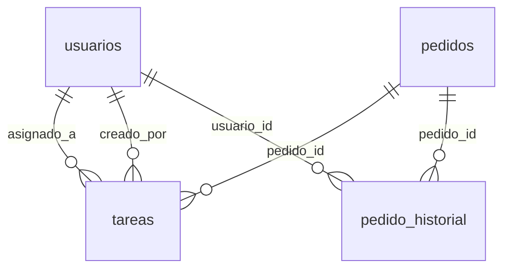

# Documentación del TFG — Todo lo implementado en *miPedido* (explicado con detalle)

Este texto está pensado para que **cualquier persona**, con o sin conocimientos de informática, pueda entender **qué hace el sistema**, **para qué sirve** y **qué limitaciones tiene**. También sirve para **copiar trozos** a la memoria del TFG.

Al final encontrarás una **lista de palabras técnicas** con explicación sencilla.

---

## 1. A quién va dirigido y cómo está organizado

- Si **no dominas informática**: lee las secciones 2 a 5 (idea general y bloques). Luego puedes ir a las partes que te interesen (pedidos, tareas, calendario, avisos, “Mi entorno”).
- Si **vas a defender el TFG**: las secciones 6 en adelante enlazan lo que cuenta el usuario con lo que hace el programa “por dentro”, sin perder el lenguaje claro.

---

## 2. Qué es *miPedido* en lenguaje cotidiano

*miPedido* es una **aplicación web**: el usuario la abre con el **navegador** (Chrome, Edge, Firefox, etc.), como si fuera una página de internet, pero es **privada** (para la empresa o el escenario de prueba del TFG).

Hace de **cuaderno digital** para una pyme:

- **Clientes** y **productos**.
- **Pedidos** (quién pidió qué, en qué estado va el trabajo).
- **Tareas** (el responsable reparte trabajo; cada empleado ve lo suyo y puede marcarlo como hecho).
- **Calendario** (ver en qué día cae cada cosa o anotarse recordatorios).
- **Avisos** (una campanita arriba recuerda plazos y cosas nuevas).
- **Mi entorno** (cada persona puede cambiar colores, menú a izquierda o derecha, etc.).

Todo eso **se guarda** en una **base de datos** (como un archivo muy ordenado en el ordenador donde está el servidor): así no se pierde la información al cerrar el navegador.

---

## 3. Mini glosario (palabras que saldrán más adelante)

| Palabra | Qué significa aquí, en simple |
|--------|-------------------------------|
| **Navegador** | Programa para ver páginas web. |
| **Pantalla / vista** | Lo que ve el usuario en un momento (listado de pedidos, calendario, etc.). |
| **Menú lateral** | Franja oscura con iconos: Dashboard, Pedidos, Tareas… |
| **Iniciar sesión** | Poner correo y contraseña para que el programa sepa quién eres. |
| **Administrador** | Usuario con más permisos (crea tareas para otros, ve más datos). |
| **Empleado** | Usuario normal (ve lo suyo y lo que le toca). |
| **Base de datos** | Lugar donde se guardan tablas (clientes, pedidos, tareas…). |
| **Servidor** | Ordenador (o contenedor Docker) que ejecuta el programa y la base de datos. |
| **Migración** | Script SQL que “actualiza” una base ya existente con columnas o tablas nuevas. |
| **Cookie** | Pequeña información que el navegador guarda para recordar algo (aquí: si el menú iba estrecho o ancho). |
| **JSON** | Formato de texto para guardar varias preferencias en un solo campo. |

---

## 4. Resumen de lo construido (sin tecnicismos)

1. **Pedidos terminados con fecha**  
   Cuando un trabajo está **realmente acabado**, se puede marcar como **“realizado”** y el sistema guarda **día y hora**. Así queda constancia para la empresa y para el TFG como “trazabilidad”.

2. **Historial de pedidos**  
   Como un **diario** del pedido: se anotan cosas importantes (se creó, pasó a realizado…). Sirve para revisar qué pasó sin preguntar a memoria.

3. **Tareas internas**  
   El **jefe o administrador** puede crear una tarea y **asignarla** a un empleado. El empleado la ve en su lista y puede ponerla **en curso** o **hecha**. Nadie puede cambiar a escondidas la tarea de otra persona de forma “tramposa” desde el navegador: el programa lo comprueba.

4. **WhatsApp sin contratar una API de pago**  
   No se “envía” WhatsApp desde el servidor como un SMS automático. Lo que hace el sistema es **preparar un mensaje** y abrir **WhatsApp del propio usuario** (móvil o web) con el texto listo, o permitir **copiar** el mensaje. Así se evita coste y cuentas empresariales complejas; es honesto para el TFG decir que es **ayuda al envío**, no envío automático.

5. **Calendario mensual**  
   Vista de **mes** donde aparecen las tareas en el día que toca (por fecha límite o por día de creación). El empleado puede crear **recordatorios propios** (“propios”) que no son órdenes del jefe.

6. **Colores en el calendario**  
   Las tareas **hechas** o **en curso** se ven distintas, para no confundirlas con las pendientes.

7. **“Mi entorno” (preferencias)**  
   Cada usuario puede elegir, entre otras cosas: **menú a la izquierda o a la derecha**, **fondo más claro u oscuro**, **color de acento** (iconos activos), y si quiere **empezar con el menú recogido** en pantallas grandes.

8. **Cabecera que se mueve con el contenido**  
   Si el menú está a la **derecha**, la franja blanca de arriba (título, campana, nombre) **no se queda debajo del menú**: ocupa solo la zona de trabajo, alineada con el resto de la página.

9. **Menú colapsado que no “se olvida”**  
   Si el usuario deja el menú **estrecho** (solo iconos) y cambia de página, **sigue estrecho** gracias a una **cookie** (recuerdo del navegador). Al **cerrar sesión**, se borra ese recuerdo para que otro usuario en el mismo ordenador no herede el mismo menú.

10. **Campana de avisos**  
    Lista corta de **recordatorios**: tareas con **fecha límite en los próximos 7 días** (con texto tipo “quedan X días”) y **tareas nuevas** que te ha puesto otra persona. Al **pulsar** un aviso, se entiende que **ya lo has visto** (cambia de aspecto y quita un puntito). Eso se guarda en el **navegador** del usuario, no en la base de datos (es una limitación a explicar en el TFG).

11. **Contador en el menú cuando está recogido**  
    Si hay tareas pendientes, el número aparece en un **círculo pequeño** encima del icono de tareas para que se vea bien con el menú estrecho.

---

## 5. Fase 4 — Pedidos, historial, tareas y WhatsApp (detalle para la memoria)

### 5.1. Marcar un pedido como “realizado”

**Problema de la vida real:** a veces un pedido sigue marcado como “en proceso” cuando en realidad **ya se entregó o se cobró el trabajo**.

**Qué hace el sistema:** aparece una acción para marcar el pedido como **realizado**. En ese momento se guarda la **fecha y hora** exactas. No se puede “realizar” dos veces el mismo pedido ni si está **cancelado**: el programa lo evita para no ensuciar los datos.

**Ideas para explicarlo en el TFG:** “cerrar el ciclo del pedido”, “evidencia de cierre”, “trazabilidad”.

### 5.2. Historial del pedido

**Problema:** “¿Quién tocó este pedido y cuándo?”.

**Qué hace el sistema:** una pantalla de **historial** lista los eventos en orden de tiempo (por ejemplo: se creó el pedido, más tarde pasó a realizado). Así se puede **auditar** sin buscar en papeles.

### 5.3. Tareas entre jefe y equipo

**Problema:** repartir trabajo y saber en qué va cada uno.

**Qué hace el sistema:**

- El **administrador** crea una tarea, escribe título (y opcionalmente descripción, pedido relacionado, fecha límite) y elige **a quién va dirigida**.
- El **empleado asignado** ve la tarea en su listado. Puede ponerla **en curso** o **hecha**.
- Si alguien intenta hacer trampa cambiando el identificador de otra tarea, el **servidor** lo rechaza: solo puedes tocar lo tuyo (salvo el admin, que tiene más alcance).

**Ideas para el TFG:** “gestión del trabajo diario”, “roles”, “seguridad básica en servidor”.

### 5.4. WhatsApp de forma sencilla, barata y más cómoda

**Problema:** avisar al cliente por WhatsApp sin pagar APIs ni configurar Meta Business.

**Qué hace el sistema ahora:**

- Si el cliente tiene un **teléfono** que el programa reconoce como válido (reglas sencillas pensadas para números españoles habituales), aparece un botón de WhatsApp “inteligente”.
- Al pulsarlo, el sistema primero intenta abrir la **app de WhatsApp** (`whatsapp://`).
- Si esa app no está disponible en ese equipo, hace “plan B” y abre **WhatsApp Web** (`wa.me`) con el texto preparado.
- Además, si la app sí se abre (la página pierde foco), el sistema evita forzar la pantalla intermedia web para no molestar al usuario.
- Hay otro botón para **copiar** ese texto por si el usuario prefiere pegarlo en otro sitio.
- **Importante:** el mensaje **no sale solo** del servidor; el **humano** debe confirmar en su WhatsApp. En la memoria conviene decir que es una **decisión de diseño** (privacidad, coste cero, menos mantenimiento) y no un “fallo”.

---

## 6. Fase 5 — Calendario de tareas

### 6.1. Para qué sirve

Mucha gente entiende mejor **un mes en cuadrícula** que una lista larga. El calendario muestra **en qué día** “cae” cada tarea: si tiene **fecha límite**, se usa esa; si no, se usa el **día en que se creó**.

### 6.2. Quién ve qué

- El **administrador** ve las tareas del **equipo** en ese mes.
- El **empleado** ve **solo las suyas** (las que le asignaron más las que él se anotó como personales).

### 6.3. Tareas “propias” (personales)

Son **notas o recordatorios** que el propio usuario crea desde el calendario: **no** son una orden del jefe. En el listado de **Tareas** llevan una **etiqueta** para que no haya confusión.

**Dato técnico (opcional en anexo):** en la base de datos existe un campo tipo sí/no (`es_personal`) ligado a cada tarea.

### 6.4. Colores según el estado

Igual que en la lista de tareas se entiende rápido el estado con **colores de fila**, en el calendario las tareas **hechas** o **en curso** también se **distinguen** para que el usuario no tenga que abrir cada una.

---

## 7. Fase 6 — “Mi entorno” (personalizar la aplicación)

### 7.1. Para qué sirve

Cada persona trabaja distinto: a unos les gusta el **menú a la izquierda**, a otros a la **derecha**; a unos les cansa la pantalla muy clara y prefieren un **tema más oscuro** en el contenido; a unos les gusta un **color de acento** distinto (iconos activos, detalles).

**Mi entorno** es una pantalla donde el usuario elige esas cosas y pulsa **Guardar preferencias**.

### 7.2. Dónde se guarda

Las elecciones se guardan **en la ficha del usuario** en la base de datos, en un campo de texto estructurado (**JSON**): es como una **nota interna** con varias casillas (lateral, color, tema…).

Al **entrar de nuevo**, el programa lee esas preferencias y pinta la pantalla igual que la dejó el usuario.

### 7.3. Menú estrecho que no “salta” al cambiar de página

Hay dos ideas mezcladas (conviene explicarlas en el TFG):

1. **Preferencia “empezar con el menú recogido”** — se guarda en la base de datos con el resto de *Mi entorno*.
2. **Lo que hizo el usuario con el botón de tres rayas** en mitad de la jornada — si solo se guardara en pantalla, **al pasar a otra página** el menú volvería ancho. Para evitar esa frustración, el navegador guarda una **cookie** muy simple (sí/no estrecho).  
   Al **cerrar sesión**, esa cookie se **borra**: así, si otro compañero usa el mismo ordenador, no hereda el menú estrecho del anterior.

---

## 8. Cabecera (franja de arriba) y barra lateral a la derecha

Cuando el menú está a la **derecha**, la zona de trabajo queda a la **izquierda**. La franja blanca de arriba (donde está “ERP miPedido”, la campana y el nombre) debe ocupar **solo esa zona** y no “invadir” el sitio del menú oscuro.

**Qué se hizo:** el bloque principal de la página tiene un **ancho calculado** restando el ancho del menú, y la cabecera va **dentro** de ese bloque. Además, en modo “menú a la derecha” se **reordena** un poco lo de la cabecera para que el menú de tres rayas quede **junto al lateral** y el usuario/campana hacia el lado del contenido: resulta más natural al usarlo.

En **móvil**, el menú pasa a ser un **panel que se abre encima**; ahí la cabecera vuelve al comportamiento habitual y ocupa todo el ancho útil.

---

## 9. Campana de avisos (qué avisa y qué no)

### 9.1. Qué problemas ayuda a resolver

- “**Se me acaba el plazo**” de una tarea sin ir al calendario cada día.
- “**Me han asignado algo nuevo**” sin estar pendiente del listado a cada minuto.

### 9.2. Qué muestra (en lenguaje llano)

- **Cuenta atrás:** si una tarea tiene fecha límite **entre hoy y los próximos siete días**, aparece una línea con el **título** y cuántos **días quedan** (o “vence hoy”). Debajo, en letra más pequeña, la **fecha y hora** del límite y una mención al **calendario**.
- **Nueva asignación:** si otra persona te ha creado una tarea “de empresa” hace poco, aparece el **título** y una segunda línea del estilo “**hace** X horas / días”.
- **Administrador:** además puede ver avisos de **límites próximos** de tareas de **cualquier** compañero, con quién está asignada.

### 9.3. Cómo se marca “ya lo he leído”

Al **pulsar** una línea, el navegador guarda en su **memoria local** (técnico: `localStorage`) que esa tarea ya la viste: **cambia el color** de la fila y **desaparece el puntito** azul. El **número rojo** de la campana cuenta solo lo **no leído**.

**Limitación honesta para el TFG:** eso **no viaja** a otro ordenador ni queda guardado en la base de datos. Si borras datos del sitio en el navegador, volverán a aparecer como “nuevos”. Para un trabajo académico suele bastar; en producción “seria” se podría guardar en servidor.

### 9.4. Ir a la tarea concreta

Al pulsar un aviso se abre el listado de **Tareas** y la pantalla **baja** hasta la fila de esa tarea (cada fila tiene un **ancla** con el número de tarea).

---

## 10. Dónde está “por dentro” la información (sin entrar en código)

Piensa en **tres capas**:

1. **Lo que ve el usuario** — pantallas, botones, colores (carpeta de vistas y plantilla principal del layout).
2. **Las reglas de negocio** — quién puede hacer qué, cómo se calculan los avisos (carpeta de controladores y modelos).
3. **Lo que se guarda** — tablas en MySQL (scripts en `config/`).

Los **scripts de migración** son archivos de texto con instrucciones para la base de datos del tipo “añade esta columna si falta”: sirven cuando el proyecto **ya estaba instalado** y no se puede borrar todo desde cero.

---

## 11. Lista de archivos importantes (qué es cada cosa, en breve)

| Carpeta o archivo | Para qué sirve, explicado simple |
|-------------------|----------------------------------|
| `config/database.sql` | “Plano inicial” de tablas y datos de ejemplo cuando la base se crea desde cero. |
| `config/migrate_fase4_…sql` | Actualiza bases **viejas** con pedido realizado, historial y tareas según la fase 4. |
| `config/migrate_fase5_…sql` | Añade lo necesario para marcar tareas **personales** del calendario. |
| `config/migrate_fase6_…sql` | Añade el sitio donde se guardan las **preferencias de pantalla** de cada usuario. |
| `config/migrate_fase8_permisos_usuarios.sql` | Crea permisos finos por usuario gestionados por admin. |
| `public/index.php` | “Índice” de la aplicación: según la página que pidas en la barra de direcciones, carga un controlador u otro. |
| `app/views/layouts/main.php` | Marco común: menú lateral, cabecera, campana, estilos generales. |
| `app/models/Pedido.php` | Toda la lógica de **leer y cambiar pedidos** y el historial en base de datos. |
| `app/views/pedidos/ventas.php` | Pantalla de análisis de ventas por mes con detalle de pedidos. |
| `app/views/pedidos/facturacion.php` | Historial de facturas con filtros y acciones de seguimiento. |
| `app/views/usuarios/edit.php` | Edición de cuenta + checkboxes de permisos administrados por el admin. |
| `app/models/Tarea.php` | Tareas, calendario mensual y **generación de la lista de avisos** de la campana. |
| `app/controllers/…` | Reciben la petición del usuario, comprueban permisos y llaman al modelo. |
| `app/views/…` | HTML que se ve en el navegador (pedidos, tareas, calendario, mi entorno…). |
| `app/helpers/whatsapp_helper.php` | Prepara números y textos para **WhatsApp** y el botón de copiar. |
| `app/helpers/preferencias_ui_helper.php` | Lee y valida las preferencias de **Mi entorno** (valores permitidos). |
| `app/helpers/nav_helper.php` | Cuenta tareas pendientes para el **número del menú** y pide los **avisos** de la campana. |
| `public/js/main.js` | Pequeños programas en el navegador: confirmaciones, WhatsApp inteligente (app -> web), copiar texto, cookie del menú, marcar avisos leídos. |

---

## 12. Qué tiene que hacer quien instala o mantiene el proyecto

1. Tener **PHP** y **MySQL** (en el TFG suele usarse **Docker** para levantar solo la base en el puerto acordado).
2. Si la base **ya existía** antes de añadir nuevas funciones, ejecutar **en orden** los tres archivos `migrate_fase4`, `migrate_fase5` y `migrate_fase6` (una vez cada uno sobre la misma base de datos del proyecto).
3. Si algo falla con un mensaje raro de “columna desconocida”, lo más habitual es que **falte ejecutar** el script de migración correspondiente.

---

## 13. Lista de comprobación (pruebas como si fueras usuario)

**Pedidos e historial**

- [ ] Crear un pedido y ver que queda registrado.
- [ ] Marcarlo como **realizado** y comprobar que sale **fecha y hora**.
- [ ] Abrir el **historial** y ver que el relato tiene sentido.
- [ ] Intentar “realizar” dos veces el mismo pedido: debe impedirlo o avisar.

**Tareas**

- [ ] El jefe crea una tarea para un empleado: el empleado la ve.
- [ ] El empleado la pasa a **en curso** y luego a **hecha**.
- [ ] Los colores del listado ayudan a ver el estado.

**WhatsApp**

- [ ] Cliente **sin** teléfono: no debe insistir con WhatsApp.
- [ ] Cliente **con** móvil razonable: intenta abrir app de WhatsApp y, si no puede, abre WhatsApp Web.
- [ ] El botón “copiar” sigue permitiendo llevar el texto al portapapeles.

**Calendario**

- [ ] Crear un recordatorio personal: aparece el día correcto y en tareas se distingue como **propia**.
- [ ] Admin ve más cosas que un empleado (según el diseño del proyecto).

**Mi entorno y menú**

- [ ] Cambiar menú a la **derecha**: la cabecera no debe quedar “debajo” del menú oscuro.
- [ ] Dejar el menú **estrecho**, ir a otra página: sigue estrecho.
- [ ] **Cerrar sesión** y entrar con otro usuario: no debe arrastrarse el menú estrecho del anterior (cookie borrada).

**Campana**

- [ ] Con una tarea con límite en la próxima semana, aparece aviso con **días restantes**.
- [ ] Al pulsar, cambia de aspecto y baja al listado de tareas en la fila correcta.

**Calendario visual**

- [ ] Una tarea **hecha** se distingue de una **pendiente** en el calendario.

**Ventas y facturación**

- [ ] En **Ventas**, al cambiar de mes, deben actualizarse total, pedidos y ticket medio.
- [ ] En **Ventas**, abrir un pedido del mes y comprobar su factura/historial.
- [ ] En **Facturación**, aplicar filtros (todas/pendientes/realizadas) y validar resultados.
- [ ] En **Facturación**, marcar una pendiente como realizada y comprobar cambio de estado.

**Permisos por usuario**

- [ ] Entrar como admin en **Usuarios -> Editar** un empleado.
- [ ] Marcar permisos individuales y guardar.
- [ ] Probar "Conceder todos los permisos" y confirmar que marca todo.
- [ ] Verificar que, si falta la migración, se muestra aviso de permisos BD.

---

## 14. Qué se podría mejorar en el futuro (sin criticar el trabajo actual)

| Idea | Por qué no está hecho así en este TFG |
|------|--------------------------------------|
| WhatsApp “oficial” de empresa | Requiere contrato con Meta, coste por mensaje y más mantenimiento. |
| Avisos guardados en servidor | Haría falta tabla nueva y lógica extra; aquí se priorizó rapidez y cero coste. |
| Subir PDF al pedido | Posible mejora documental, no era el foco. |

---

## 15. Tabla rápida de migraciones (nombre → qué aporta)

| Archivo | En una frase |
|---------|----------------|
| `migrate_fase4_pedidos_realizado_tareas_historial.sql` | Realizado en pedidos, historial y base de tareas según esta fase. |
| `migrate_fase5_calendario_es_personal.sql` | Permite distinguir tareas **personales** del calendario. |
| `migrate_fase6_preferencias_ui.sql` | Guarda las opciones de **Mi entorno** por usuario. |
| `migrate_fase7_seguridad_login_csrf_sesion.sql` | Añade bloqueo de login escalado y base de seguridad para esta fase. |
| `migrate_fase8_permisos_usuarios.sql` | Crea catálogo de permisos y asignaciones por usuario. |
| `migrate_fase9_onboarding_admin.sql` | Añade tutorial inicial para admin (por versión) y prepara clave de espacio de trabajo. |
| `migrate_fase10_workspace_aislamiento.sql` | Aísla datos por workspace para que cada admin tenga entorno propio y empleados hereden ese entorno. |
| `migrate_fase11_verificacion_correo.sql` | Añade estado simple de verificación de correo (simulación para demo TFG). |
| `migrate_fase12_planes_usuario.sql` | Añade selección de plan simulada para admin y control de cambio mensual. |

---

## 16. Mejora de seguridad (fase 7) explicada fácil

En esta fase se añadieron tres protecciones nuevas, pensadas para que se entiendan rápido y sin complicar el código.

### 16.1 Bloqueo de login por intentos repetidos

**Qué problema resuelve:**  
Si alguien prueba muchas contraseñas seguidas, puede adivinar por fuerza bruta.

**Qué hace ahora el sistema:**  
- Cuando un usuario falla 5 veces seguidas, se bloquea **15 minutos**.  
- Si después de ese bloqueo vuelve a fallar 5 veces, se bloquea **24 horas**.  
- Tras pasar esas 24 horas, el ciclo vuelve a empezar (la próxima vez vuelve a ser 15 minutos).  

**Cómo se guardó técnicamente (sin complicar):**  
Se añadieron 3 campos en `usuarios`: contador de fallos, “fase” del bloqueo (15m o 24h) y fecha/hora hasta la que está bloqueado.

**Prueba manual rápida:**  
1. Fallar 5 veces -> aparece bloqueo 15 minutos.  
2. Esperar a que pase ese tiempo y fallar 5 veces otra vez -> aparece bloqueo 24 horas.  
3. Pasadas 24h -> se puede volver a intentar y el siguiente bloqueo vuelve a 15 minutos.

### 16.2 Sesión y cookies más seguras (producción HTTPS)

**Qué problema resuelve:**  
Proteger mejor la “llave” de la sesión para que no sea fácil robarla.

**Qué hace ahora el sistema:**  
- Cookie de sesión con `HttpOnly` (JavaScript no la puede leer).  
- Cookie `Secure` cuando el entorno usa HTTPS.  
- `SameSite=Lax` para reducir envíos cruzados peligrosos.  
- Al iniciar sesión correctamente se regenera el ID de sesión.

**Prueba manual rápida:**  
Entrar con usuario válido y revisar en navegador que la sesión se mantiene bien entre páginas, y que al cerrar sesión se pierde.

### 16.3 Protección CSRF en formularios

**Qué problema resuelve:**  
Evitar que una web externa intente enviar formularios “en tu nombre” mientras estás logueado.

**Qué hace ahora el sistema:**  
- Cada formulario POST lleva un token oculto (`_csrf`).  
- Ese token se compara con el guardado en sesión.  
- Si no coincide (o falta), la acción se rechaza.

**Dónde se aplicó:**  
Login, alta/edición de clientes, productos, pedidos, usuarios, tareas, calendario personal y preferencias de “Mi entorno”.

**Prueba manual rápida:**  
Quitar el campo `_csrf` con las herramientas del navegador y enviar: debe dar error de formulario inválido/caducado.

---

## 17. Cierre

Este proyecto demuestra, de punta a punta, cómo una pyme puede **digitalizar pedidos, seguimiento interno y comunicación con cliente** con herramientas sencillas (navegador + base de datos), sin olvidar **usabilidad** (calendario, avisos, personalización) y siendo **transparente** con lo que el software **sí hace** y **no hace** (WhatsApp, avisos locales).

Si en el tribunal hay personas **no técnicas**, las secciones 2 a 5 y 9.1–9.2 son buen material para oral; las secciones 10 y 11 sirven de **puente** hacia el anexo técnico o el código.

---

## 18. Mejora de analítica en dashboard (ventas + productos más vendidos)

Esta mejora se centró en que el panel fuese más útil para tomar decisiones, sin hacerlo complicado.

### 18.1 Navegar ventas por bloques de 6 meses

**Qué problema había:**  
Ver solo “los últimos 6 meses” fijos no dejaba comparar con periodos anteriores.

**Qué hace ahora:**  
- El gráfico de ventas permite ir **6 meses atrás** y **6 meses adelante**.
- Se limita a un máximo de **3 años hacia atrás** para mantenerlo simple y rápido.
- Así puedes comparar tendencias por tramos (por ejemplo: semestre actual vs semestre anterior).

### 18.2 Productos más vendidos debajo del gráfico

**Qué problema había:**  
Se veía el dinero total, pero no qué productos lo generaban.

**Qué hace ahora:**  
- Debajo del gráfico de ventas aparece una tabla con el **Top 5 productos más vendidos**.
- Muestra nombre del producto, unidades vendidas y total facturado.
- Este ranking se calcula en el **mismo periodo** que el gráfico de ventas (si cambias el bloque, cambia el ranking).

### 18.3 Prueba manual rápida

1. Entrar a Dashboard y anotar barras y top de productos.  
2. Pulsar **“6 meses atrás”** y comprobar que cambian los datos.  
3. Volver con **“6 meses adelante”** y verificar que recupera el bloque reciente.  
4. Intentar ir más atrás de 3 años: el botón debe quedar deshabilitado.

---

## 19. Módulos nuevos: Ventas y Facturación (detalle completo)

En esta ampliación se separó la información comercial en dos pantallas específicas para que el usuario no dependa solo del dashboard.

### 19.1. Módulo **Ventas**

**Qué problema resuelve:**  
El dashboard da una vista rápida, pero para revisar ventas con calma hacía falta más detalle operativo.

**Qué muestra ahora:**

- Historial mensual de ventas (hasta 36 meses).
- Para cada mes:
  - total vendido,
  - número de pedidos,
  - ticket medio.
- Selector de mes (`YYYY-MM`) para abrir el desglose exacto.
- Detalle de pedidos del mes con:
  - cliente,
  - fecha,
  - estado,
  - método de pago,
  - total del pedido,
  - acceso a factura e historial.

**Valor para negocio (en simple):**  
Permite detectar meses fuertes o flojos y revisar rápidamente qué pedidos explican esos resultados.

### 19.2. Módulo **Facturación**

**Qué problema resuelve:**  
Antes la factura se veía desde cada pedido individual; faltaba una vista “de oficina” para revisar todo junto.

**Qué muestra ahora:**

- Historial de facturas con filtros:
  - todas,
  - pendientes,
  - realizadas.
- En cada fila:
  - número de factura (basado en pedido),
  - fecha,
  - cliente,
  - estado factura (pendiente/realizada),
  - estado del pedido,
  - método de pago,
  - total.
- Acciones directas:
  - ver/imprimir factura,
  - ver historial del pedido,
  - cerrar como realizada si está pendiente,
  - editar factura pendiente (abre en nueva pestaña para trabajar sin perder el listado).

**Ajuste visual/flujo reciente:**  
Se retiró el botón de revertir/reemitir del listado para evitar acciones redundantes y simplificar la operativa diaria.

### 19.3. Pruebas rápidas recomendadas

1. Entrar en **Ventas** y cambiar mes con el selector.  
2. Ver que cambian total, pedidos y ticket medio del mes.  
3. Entrar en **Facturación** y usar filtros (todas/pendientes/realizadas).  
4. Abrir una factura, volver y cerrar un pedido como realizado.  
5. Confirmar que su estado cambia en el historial de facturación.

---

## 20. Portal público + registro de cuenta + Google con Auth0

Esta fase añade una entrada pública para presentar el producto y mejorar el acceso inicial.

### 20.1. Pantalla de presentación (`home`)

**Qué hace:**  
- Muestra de forma visual qué incluye miPedido (pedidos, ventas, facturación, tareas, seguridad, etc.).
- Incluye secciones que aparecen progresivamente al bajar (animación suave de entrada).
- En la parte superior aparecen los dos accesos principales:
  - **Iniciar sesión**
  - **Crear cuenta**

### 20.2. Pantalla de crear cuenta (`register`)

**Qué hace:**  
- Permite alta local con nombre, email y contraseña (con validaciones básicas).
- Si el registro local es correcto, el usuario recibe confirmación y puede entrar por login.

### 20.3. Registro/inicio con Google usando Auth0

**Diseño elegido:**  
Google no se conecta “directo” al código propio; se usa **Auth0** como intermediario para simplificar seguridad y mantenimiento.

**Rutas añadidas:**
- `index.php?page=home`
- `index.php?page=login`
- `index.php?page=register`
- `index.php?page=register_store`
- `index.php?page=auth_google_start`
- `index.php?page=auth_google_callback`

**Variables de entorno necesarias (`AUTH0_*`):**
- `AUTH0_DOMAIN`
- `AUTH0_CLIENT_ID`
- `AUTH0_CLIENT_SECRET`
- `AUTH0_CONNECTION` (normalmente `google-oauth2`)
- `AUTH0_REDIRECT_URI` (opcional; si falta, se calcula automáticamente)

**Fuente fiable principal (oficial):**  
- Auth0 Docs: [https://auth0.com/docs](https://auth0.com/docs)

### 20.4. Coherencia de seguridad en acciones críticas

Para cerrar incongruencias funcionales detectadas durante pruebas:

- **Eliminar pedido no realizado**:
  - repone stock automáticamente en productos.
- **Pedido realizado**:
  - no se permite eliminar (ni en UI ni en backend).
- **Acciones sensibles** (eliminar y marcar realizado):
  - se ejecutan por **POST + token CSRF**.
  - no quedan como simples enlaces GET.

### 20.5. Pruebas rápidas de esta fase

1. Abrir `index.php` y comprobar que entra en presentación pública.  
2. Pulsar **Crear cuenta** y registrar un usuario local.  
3. Iniciar sesión con ese usuario y navegar normal.  
4. En facturación, comprobar que **Editar** abre en nueva pestaña.  
5. En pedidos, intentar borrar uno realizado: debe estar bloqueado.  
6. Borrar uno pendiente y verificar que el stock vuelve a su valor correcto.

---

## 21. Onboarding inicial para administradores (fase 9)

### 21.1 Qué problema resuelve

Cuando entra un administrador nuevo, puede no saber por dónde empezar en el panel.  
Se añadió una guía corta, visual y no invasiva para explicar las zonas principales del dashboard.

### 21.2 Cómo funciona

- El sistema guarda un campo `onboarding_version` en `usuarios`.
- Si un admin tiene `onboarding_version = 0`, al entrar al dashboard se muestran “globos” guiados (paso a paso).
- Al pulsar **Finalizar**, se guarda la versión completada (`1`) y la guía no vuelve a aparecer.
- Al usar versión en vez de sí/no, en el futuro se puede lanzar otro mini-tour (v2, v3...) sin romper datos antiguos.

### 21.3 Qué se enseña en la guía

1. Tarjetas KPI principales.  
2. Panel de ventas por mes.  
3. Ranking de productos más vendidos.

### 21.4 SQL útil para pruebas

Si quieres que admins existentes vuelvan a ver la guía:

`UPDATE usuarios SET onboarding_version = 0 WHERE rol = 'admin';`

### 21.5 Sobre “entorno limpio” en cuentas nuevas

Se añadió también `workspace_key` a `usuarios` como base para una futura separación total de datos por cuenta.  
En esta fase no se activó aislamiento completo en todas las tablas para evitar una migración grande e invasiva justo antes de defensa.

---

## 22. Entorno limpio por cuenta admin (fase 10)

### 22.1 Regla funcional aplicada

- Un **admin nuevo** entra con entorno limpio (su propio workspace).
- Un **empleado** queda ligado al workspace de su admin y por eso ve esos mismos datos.
- Un admin de otro workspace no ve datos ajenos.

### 22.2 Qué se filtró por workspace

- Clientes
- Productos
- Pedidos (incluye facturación, historial y estados)
- Ventas
- Tareas y calendario
- KPIs de dashboard y campana de avisos

### 22.3 Migración recomendada

Ejecutar: `config/migrate_fase10_workspace_aislamiento.sql`

La migración:
- añade `workspace_key` en tablas de negocio,
- hace backfill de datos antiguos a un workspace legado para no perder continuidad.

---

## 23. Verificación de correo (fase 11, simulación junior)

### 23.1 Objetivo práctico

Se pidió mostrar en `Configuración` un estado de cuenta verificada, sin implementar un sistema complejo de correo real.

### 23.2 Qué se implementó

- En la tarjeta de cuenta, junto al campo `Rol`, aparece:
  - botón **Verificar correo** si el estado es pendiente,
  - etiqueta **Cuenta Verificada** cuando ya se marcó.
- Solo se guarda un flag simple en base de datos (`email_verificado`).
- No hay OTP ni envío real de correo en esta fase.

### 23.3 Por qué así (enfoque junior)

- Es más fácil de explicar y mantener para una memoria de TFG de nivel inicial.
- Cumple la experiencia visual/funcional pedida por el tutor o cliente.
- Evita dependencias externas (SMTP, API de correo) que complican la demo.

---

## 24. Errores reales e inconvenientes encontrados (y solución)

Esta sección resume problemas que ocurrieron durante el desarrollo real, útil para justificar trabajo técnico en la defensa.

### 24.1 Error SQL 1064 en migraciones

**Síntoma:**  
MySQL Workbench devolvía error de sintaxis con `ADD COLUMN IF NOT EXISTS`.

**Causa:**  
La versión/configuración de MySQL del entorno no soportaba ese patrón en todos los casos.

**Solución aplicada:**  
Migraciones reescritas con comprobación previa en `INFORMATION_SCHEMA.COLUMNS` y ejecución con `PREPARE/EXECUTE`.

### 24.2 Error SQL 1054 (`Unknown column 'workspace_key'`)

**Síntoma:**  
Fallo al cargar dashboard o login social por columna inexistente.

**Causa:**  
Código actualizado antes de ejecutar migraciones nuevas.

**Solución aplicada:**  
Ejecutar migraciones fase 9 y fase 10, recargar sesión y volver a probar.

### 24.3 Error Auth0: “No se recibió token”

**Causa 1:** dominio Auth0 mal escrito.  
**Causa 2:** extensiones `curl` y `openssl` desactivadas en PHP.

**Solución aplicada:**  
Corregir `AUTH0_DOMAIN` y activar extensiones en `php.ini`.

### 24.4 Problema visual en globo de onboarding

**Síntoma:**  
El globo quedaba cortado en pantallas con poco alto.

**Solución aplicada:**  
Reposicionamiento dinámico del globo (arriba/abajo/lados) y límites por viewport.

### 24.5 Decisión de simplificación de verificación de correo

Se inició una versión avanzada (OTP), pero se descartó para mantener coherencia con el enfoque junior del proyecto.  
Resultado final: verificación simulada, estable y fácil de explicar.

### 24.6 Ajustes de estilo para mantener nivel junior

- Se evitó añadir dependencias de correo externas para no complicar el despliegue.
- Se priorizaron validaciones directas y flujo sencillo en pantallas clave.
- Se mantuvo código funcional ya probado, evitando refactors grandes que podían romper la demo.
- La complejidad "avanzada" se dejó documentada como evolución futura y no como requisito actual.

---

## 25. Seleccion de plan para admin (fase 12, simulacion junior)

### 25.1 Objetivo

Al crear una cuenta admin nueva, se añade un paso inicial para elegir plan (Basico, Profesional o Avanzado), alineado con la landing y enfocado a demo academica.

### 25.2 Flujo funcional

- Si el admin inicia sesion sin plan asignado, se redirige a `plan_select`.
- La seleccion abre una mini-ventana/modal para completar datos mock.
- Al confirmar, se guarda solo el plan elegido y fechas de control.
- En `Configuracion`, el admin ve su plan y puede cambiarlo una vez cada 30 dias (simulacion).

### 25.3 Recomendaciones de seguridad aplicadas

- Se solicitan solo datos no sensibles de ejemplo:
  - nombre y apellidos (demo),
  - DNI simple (demo),
  - email de facturacion,
  - **ultimos 4 digitos** de tarjeta,
  - caducidad.
- No se guarda ni procesa tarjeta completa.
- Mensaje visible y obligatorio en interfaz:
  - **"simulacion academica, no se procesa ningun pago real"**.

### 25.4 Campos tecnicos anadidos en `usuarios`

- `plan_actual` (`basico`, `profesional`, `avanzado`)
- `plan_elegido_at` (fecha de primera eleccion)
- `plan_cambiado_at` (fecha del ultimo cambio para cooldown mensual)

### 25.5 Justificacion nivel junior

- Da realismo para defensa sin integrar pasarelas de pago reales.
- Evita manejo de datos sensibles y reduce riesgo legal/tecnico.
- Mantiene un flujo sencillo, demostrable y facil de explicar al tribunal.

---

## 26. Limpieza final de scripts SQL (orden y claridad)

Para mantener el proyecto en nivel junior y facilitar la defensa, se dejó una estructura SQL más clara:

- Archivo principal para instalación nueva:
  - `config/database.sql`
- Actualizaciones para bases antiguas:
  - `config/migrate_fase4_...sql` hasta `config/migrate_fase12_...sql`
- Guía rápida de uso:
  - `config/README_SQL.md`

También se retiraron scripts de parche antiguos que ya no forman parte del flujo normal de instalación, para evitar confusión.

Resultado: menos ruido en la carpeta `config`, proceso más fácil de explicar y menor riesgo de ejecutar scripts equivocados.

---

## Anexo (opcional) — Relación entre tablas principales

Si en la memoria quieres un **esquema** para lectores técnicos, puedes insertar este diagrama. Significa: “un usuario puede tener muchas tareas; un pedido puede tener muchas líneas de historial”, etc.

---

*Documento actualizado para el TFG del proyecto **miPedido**.*
